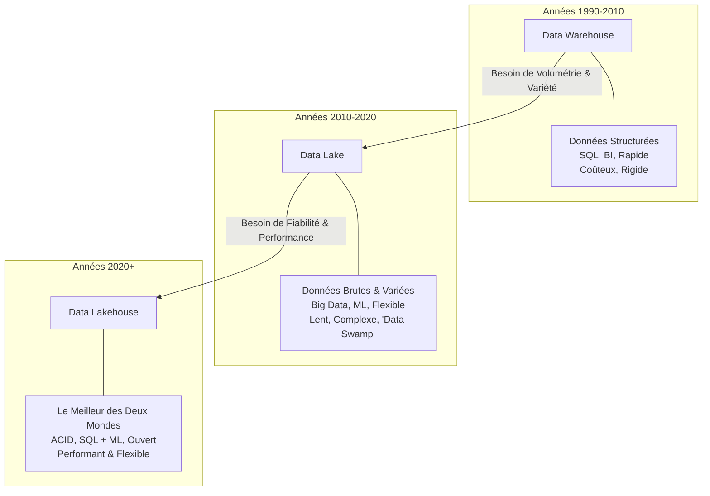

# Chapitre 1 : Le Monde du Lakehouse Apache Iceberg - Gemini 3 Pro

Bienvenue dans l'ère moderne de l'architecture de données. Ce chapitre pose les fondations nécessaires pour comprendre pourquoi nous sommes ici, comment nous y sommes arrivés, et pourquoi Apache Iceberg est devenu la clé de voûte des stratégies de données modernes. En tant qu'architecte, votre rôle est de concevoir des systèmes pérennes, performants et évolutifs. Pour cela, il est crucial de comprendre l'évolution du "Pourquoi" avant de plonger dans le "Comment".

## 1.1 Qu'est-ce qu'un data lakehouse ?

Le **Data Lakehouse** n'est pas simplement un nouveau mot à la mode ("buzzword") ; c'est la synthèse pragmatique de décennies d'évolution dans la gestion des données analytiques. Pour comprendre sa valeur, il faut retracer le chemin parcouru, des entrepôts de données traditionnels aux lacs de données, jusqu'à cette convergence.

### L'Évolution des Architectures de Données

Visualisons cette transition technologique majeure qui s'est opérée au cours des 15 dernières années.



#### L'Ère du Data Warehouse (Le Passé Stable)

Pendant longtemps, le **Data Warehouse (Entrepôt de Données)** a régné en maître. Construit sur des bases de données relationnelles robustes (Teradata, Oracle Exadata, puis Snowflake, BigQuery), il offrait performance, fiabilité (transactions ACID) et structure. Cependant, il était coûteux, rigide (schema-on-write), et mal adapté aux données non structurées (logs, images, textes) qui ont explosé avec le web et le mobile.

#### L'Ère du Data Lake (Le Far West Hadoop)

Pour répondre à l'explosion du volume et de la variété des données (les "3 V" du Big Data), le **Data Lake** est apparu, propulsé par l'écosystème Hadoop (HDFS) puis le stockage objet Cloud (S3, ADLS). La promesse était belle : stocker tout, à bas coût, dans n'importe quel format.
La réalité fut plus complexe. Si le stockage était bon marché, la gestion devenait cauchemardesque. Sans transactions ACID, les mises à jour étaient périlleuses. Sans schéma strict, les lacs devenaient souvent des "marécages de données" (Data Swamps), où la qualité de la donnée était invérifiable.

#### L'Ère du Data Lakehouse (La Synthèse)

Le **Lakehouse** émerge comme la solution de convergence. Il combine :

1.  La **flexibilité et le faible coût du stockage** du Data Lake (fichiers Parquet/Avro sur S3/ADLS/GCS).
2.  La **gestion, la fiabilité ACID et la performance** du Data Warehouse.

C'est ici qu'intervient **Apache Iceberg**. Il est le maillon manquant technologique qui permet d'apporter les fonctionnalités d'un entrepôt de données (fiabilité, SQL) directement sur les fichiers d'un lac de données.

### Tableau Comparatif : Warehouse vs Lake vs Lakehouse

| Caractéristique           | Data Warehouse              | Data Lake                                       | Data Lakehouse                           |
| :------------------------ | :-------------------------- | :---------------------------------------------- | :--------------------------------------- |
| **Type de Données**       | Structurées                 | Structurées, Semi-structurées, Non-structurées  | Tout type (unifié)                       |
| **Stockage**              | Propriétaire (généralement) | Fichiers ouverts (Blob storage, HDFS)           | Fichiers ouverts (Layer Transactionnel)  |
| **Fiabilité**             | Haute (ACID)                | Basse (Fichiers immuables, pas de transactions) | Haute (ACID via Table Format)            |
| **Coût de Stockage**      | Élevé                       | Faible                                          | Faible                                   |
| **Qualité des Données**   | Haute (Schema-on-Write)     | Variable (Schema-on-Read)                       | Haute (Validation & Évolution de Schéma) |
| **Principal Cas d'Usage** | BI, Reporting               | Data Science, ML, Archivage                     | BI, ML, Streaming, Analytics             |

## 1.2 Qu'est-ce qu'Apache Iceberg ?

Apache Iceberg est un **format de table ouvert** (open table format) pour d'énormes ensembles de données analytiques.

### L'Origine : Né chez Netflix

Iceberg n'est pas né d'un exercice académique, mais d'un besoin critique de production. En 2017, chez **Netflix**, les ingénieurs (notamment Ryan Blue et Dan Weeks) se heurtaient aux limites massives d'Apache Hive pour gérer leur catalogue de centaines de pétaoctets de données sur S3.
Les problèmes rencontrés étaient majeurs :

- **Pas de garanties ACID** : Difficile de modifier des données en toute confiance pendant que d'autres les lisaient.
- **Performances imprévisibles** : Lister des millions de fichiers dans des répertoires S3 prenait un temps fou.
- **Héritage Hadoop** : Hive supposait un système de fichiers hiérarchique, ce qui est inefficace sur le stockage objet Cloud (S3).

Iceberg a été conçu pour résoudre ces problèmes fondamentaux en changeant de paradigme : **on ne gère plus des dossiers, on gère une liste précise de fichiers.**

### Définition Technique

Concrètement, Iceberg est une couche de métadonnées qui se place _au-dessus_ de vos fichiers de données (Parquet, ORC, Avro) et _en-dessous_ de vos moteurs de calcul (Spark, Trino, Flink, Snowflake).
Il permet à de multiples moteurs de lire et d'écrire sur les mêmes tables simultanément, de manière sûre et cohérente, sans dépendre d'un fournisseur unique (Vendor Lock-in).

C'est un standard **100% Open Source** (Apache Software Foundation), soutenu aujourd'hui par tous les géants de la Tech (Netflix, Apple, Amazon, Google, Snowflake, Tabular, etc.). Apple, par exemple, utilise massivement Iceberg pour ses propres infrastructures de données critiques, contribuant à sa robustesse.

## 1.3 Les avantages d'Apache Iceberg

Pourquoi les architectes du monde entier standardisent-ils sur Iceberg ? Voici les capacités clés qui changent la donne :

### 1. Transactions ACID

C'est la fonctionnalité phare. Iceberg garantit que les lecteurs ne voient jamais de données partielles ou corrompues.

- **Atomicité** : Une écriture réussit complètement ou échoue complètement.
- **Isolation** : Les lectures simultanées n'interfèrent pas avec les écritures (Snapshot Isolation).

### 2. Évolution de Schéma (Schema Evolution) sans douleur

Dans le monde Hive/Hadoop, renommer une colonne ou changer son type était une opération risquée et lourde (nécessitant souvent la réécriture complète des données).
Avec Iceberg, ces opérations sont de simples mises à jour de métadonnées, instantanées et sûres (pas d'effets de bord). Vous pouvez ajouter, supprimer, renommer ou réordonner des colonnes sans casser les requêtes existantes.

### 3. Partitionnement Masqué (Hidden Partitioning)

C'est une innovation majeure pour la convivialité.

- **Avant (Hive)** : L'utilisateur devait _savoir_ qu'une table était partitionnée par jour (`date=2024-01-01`) et écrire sa requête SQL spécifiquement pour inclure cette clause, sinon la requête scannait tout (full table scan).
- **Avec Iceberg** : Le partitionnement est une configuration de la table, pas une contrainte pour l'utilisateur. L'utilisateur requête `WHERE timestamp > '2024-01-01'` et Iceberg sait intelligemment quels fichiers (partitions) lire, sans que l'utilisateur ait besoin de connaître la structure physique sous-jacente.

### 4. Voyage dans le Temps (Time Travel)

Puisque Iceberg gère des versions (snapshots) de la table, vous pouvez interroger la table telle qu'elle était à un moment précis.
Exemple SQL :

```sql
SELECT * FROM ma_table FOR SYSTEM_TIME AS OF '2024-01-10 10:00:00';
```

C'est inestimable pour le débogage, les audits, ou pour reproduire des modèles de ML avec les données exactes de la semaine passée.

## 1.4 Les composants d'un lakehouse Iceberg

Pour bâtir une architecture Lakehouse avec Iceberg, vous avez besoin de plusieurs briques logiques. Iceberg est le liant central.

1.  **Couche de Stockage (Storage)** : L'endroit où résident physiquement les fichiers (S3, ADLS Gen2, GCS, MinIO). C'est le "Lake".
2.  **Format de Fichier** : Les formats colonnaires optimisés pour l'analytique (Apache Parquet est le standard de facto, parfois ORC ou Avro).
3.  **Format de Table (Iceberg)** : La couche de métadonnées qui organise ces fichiers en une "Table" cohérente.
4.  **Catalogue (Catalog)** : Le composant critique qui garde la référence de la "version actuelle" de chaque table (ex: AWS Glue, REST Catalog, Nessie, Hive Metastore). C'est le point d'entrée unique pour la cohérence.
5.  **Moteurs de Calcul (Compute)** : Les outils qui traitent les données.
    - **Ingestion** : Spark, Flink.
    - **Requête/Analyse** : Trino, Spark SQL, Dremio, Starburst, Snowflake, Athena.

Dans un Lakehouse Iceberg, vous pouvez utiliser Spark pour écrire des données lourdes la nuit, et Trino pour que vos analystes requêtent ces mêmes données le jour, le tout sur la même copie physique des données.

## 1.5 Résumé

Dans ce chapitre, nous avons vu que :

- Le **Lakehouse** est l'évolution naturelle combinant la flexibilité du Data Lake et la rigueur du Data Warehouse.
- **Apache Iceberg** est le standard ouvert qui rend cette architecture possible en apportant les transactions ACID, l'évolution de schéma et la performance sur le stockage objet.
- Contrairement aux solutions propriétaires, Iceberg offre une liberté totale de choix des moteurs de calcul sur une couche de stockage unifiée.

Dans le prochain chapitre, nous plongerons techniquement, sous le capot, pour comprendre comment Iceberg réalise cette magie grâce à son architecture de fichiers et de métadonnées.
