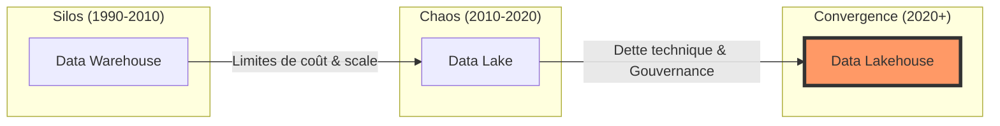

# Chapitre 1 : L'Impératif du Lakehouse et l'Avènement d'Apache Iceberg

En tant qu'architecte de données, votre mission dépasse la simple gestion du stockage ; vous êtes le garant de la fiabilité, de la conformité et de l'agilité analytique de l'organisation. Ce chapitre explore la transition vers l'architecture **Data Lakehouse** sous un angle stratégique, en démontrant pourquoi Apache Iceberg est devenu le standard de choix pour les infrastructures modernes, notamment dans le contexte exigeant des entreprises nord-américaines.

## 1.1 Qu'est-ce qu'un data lakehouse : Une Nécessité Évolutive

L'histoire de l'analytique est une quête d'équilibre entre **rigueur** et **agilité**. Pour l'architecte, le passage au Lakehouse n'est pas une simple mise à jour technique, mais une réponse aux échecs opérationnels des modèles précédents.

### La trajectoire de la donnée (2010-2025)

L'évolution peut être synthétisée par le passage d'une structure fermée à une flexibilité totale, pour finalement aboutir à une **flexibilité gouvernée**.

#### Le Dilemme de l'Architecte

- **Le Data Warehouse (DW)** : Offrait la sécurité des transactions ACID mais à un coût prohibitif dès que l'on dépassait quelques téraoctets. Sa structure rigide freinait l'innovation (besoin de mois pour modifier un schéma).
- **Le Data Lake (DL)** : A promis une liberté absolue (Hadoop, S3). Cependant, l'absence de couche transactionnelle a créé une "dette de données" massive. Les architectes au Québec, souvent confrontés à des réglementations strictes, ont vu dans les lacs de données des risques de conformité majeurs (difficulté à supprimer des données précises, incohérence des rapports).

#### L'Émergence du Lakehouse

Le Lakehouse est le paradigme où l'on déploie les fonctionnalités d'un entrepôt directement sur le stockage objet (S3, ADLS). C'est la fin du compromis entre le coût et la fiabilité.

### Comparaison Stratégique des Modèles

| Pilier Architectural         | Data Warehouse       | Data Lake            | Data Lakehouse (Iceberg)     |
| :--------------------------- | :------------------- | :------------------- | :--------------------------- |
| **Gouvernance**              | Centralisée & Rigide | Faible / Inexistante | Partagée & Standardisée      |
| **Agilité (Time-to-Market)** | Faible (ETL lourd)   | Haute (mais risquée) | Haute (Schémas évolutifs)    |
| **Interopérabilité**         | Faible (Lock-in)     | Haute (Fichiers)     | Maximale (Moteurs multiples) |
| **Coût (TCO)**               | Élevé (Propriétaire) | Faible (Raw storage) | Optimisé (Pay-as-you-go)     |

## 1.2 Qu'est-ce qu'Apache Iceberg ? Le Standard Ouvert

Apache Iceberg n'est pas un moteur de base de données. C'est une **spécification de format de table** qui agit comme l'arbitre entre vos données et vos moteurs de calcul.

### Le "Pourquoi" : L'héritage de Netflix et Apple

La naissance d'Iceberg chez Netflix en 2017 répondait à un problème d'échelle sans précédent. Le format Hive traditionnel, basé sur une structure de dossiers, s'effondrait sur le stockage objet Cloud (problèmes de performance pour lister les fichiers, absence d'atomicité).

Apple a rejoint cette mouvance pour garantir la pérennité de ses données. Pour un architecte, ce soutien par des géants de la tech garantit une **durabilité du standard** sur le long terme. C'est un point crucial pour les décideurs : Iceberg n'est pas une technologie de niche, c'est l'infrastructure de base des leaders mondiaux.

### La rupture technologique

Iceberg traite vos fichiers comme une table relationnelle. Il ne s'appuie plus sur la structure physique des répertoires pour définir les partitions, mais sur un **manifeste de métadonnées**. Cela permet une séparation totale entre la vue logique (la table SQL) et la réalité physique (les fichiers Parquet/Avro).

## 1.3 Les avantages opérationnels d'Apache Iceberg

Pour un architecte senior, les bénéfices d'Iceberg se traduisent directement en gains opérationnels et en réduction de risques.

### 1. Transactions ACID et Cohérence

Fini le temps où un job Spark en échec laissait des données corrompues dans votre lac. Iceberg implémente l'isolation des snapshots. Les utilisateurs lisent une version stable pendant que l'ingestion écrit la suivante.

### 2. Évolution de Schéma (Schema Evolution)

C'est le gain de productivité numéro 1. Iceberg permet d'ajouter ou de renommer des colonnes sans jamais réécrire de fichiers de données. Pour vos équipes "Data Engineering", cela signifie moins de maintenance et une réponse plus rapide aux besoins métiers.

### 3. Partitionnement Masqué (Hidden Partitioning)

Iceberg élimine les erreurs humaines courantes. Les analystes n'ont plus à savoir qu'une table est partitionnée par `annee/mois/jour`. Ils écrivent du SQL standard, et Iceberg optimise automatiquement la lecture. C'est l'abstraction la plus puissante pour simplifier l'accès à la donnée.

### 4. Voyage dans le Temps (Time Travel) & Rollback

La capacité de revenir à une version précédente d'une table en une seconde est une police d'assurance vitale. Que ce soit pour l'audit, la conformité (ex: Loi 25 au Québec) ou la correction d'erreurs humaines, c'est une fonctionnalité "mission-critique".

## 1.4 L'Écosystème Lakehouse Iceberg

L'architecture Iceberg repose sur une pile technologique modulaire, évitant le verrouillage par un fournisseur unique.

1.  **Stockage (Object Store)** : AWS S3, Azure Data Lake Storage (ADLS), Google Cloud Storage.
2.  **Moteurs de Transformation** : Apache Spark (standard), Apache Flink (streaming).
3.  **Moteurs de Requête (Query)** : Trino/Presto (SQL haute performance), Snowflake (via Iceberg Tables), Amazon Athena.
4.  **Catalogue (Le Cerveau)** : AWS Glue, Project Nessie, ou REST Catalog. C'est ici que réside la source de vérité.

Cette modularité est particulièrement pertinente pour les entreprises au Québec qui adoptent souvent des stratégies **multi-cloud** ou **hybrides**.

## 1.5 Résumé pour le Décideur

- Le **Data Lakehouse** corrige les dérives du Data Lake en y apportant la rigueur transactionnelle.
- **Apache Iceberg** est le standard de métadonnées qui unifie votre écosystème, permettant à plusieurs outils de travailler sur la même donnée sans conflit.
- C'est un investissement dans **l'interopérabilité** : vos données restent dans des formats ouverts (Parquet), prêtes pour les technologies de demain.

Le chapitre suivant détaillera le fonctionnement interne (Architecture de fichiers) pour comprendre comment cette abstraction est physiquement réalisée.
