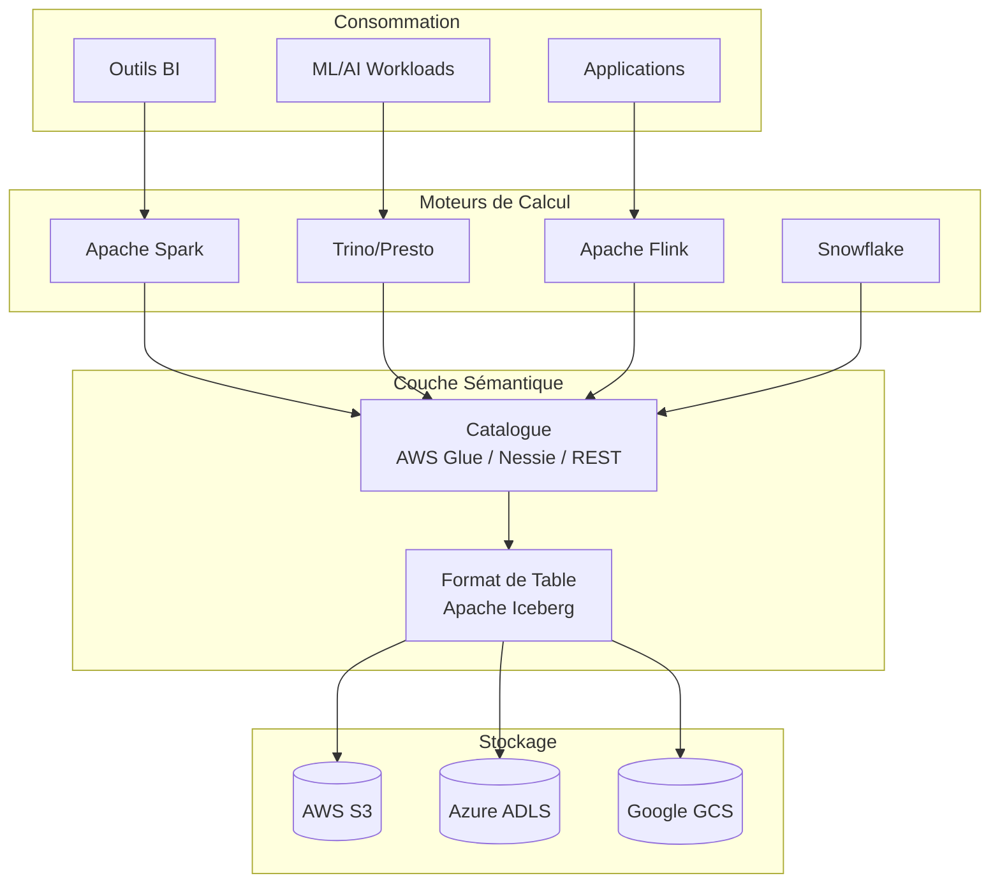

# Chapitre 1 : Le Monde du Lakehouse Apache Iceberg

## Introduction

Ce chapitre inaugure notre exploration approfondie d'Apache Iceberg en établissant les fondements essentiels pour comprendre cette technologie révolutionnaire. Avant de plonger dans les détails techniques, nous devons d'abord répondre à une question fondamentale : **pourquoi avons-nous besoin d'un format de table ouvert comme Iceberg ?**

La réponse réside dans l'évolution des architectures de données au cours des deux dernières décennies, une évolution marquée par des compromis constants entre performance, coût, flexibilité et fiabilité.

---

## 1.1 Qu'est-ce qu'un Data Lakehouse ?

### De l'Entrepôt au Lac, puis au Lakehouse

L'architecture de données moderne est le fruit d'une évolution en trois actes. Chaque paradigme est né des limitations de son prédécesseur.

```mermaid
timeline
    title Évolution des Architectures de Données
    section Ère 1 : Entrepôts
        1990s-2000s : Data Warehouse
                    : Teradata, Oracle
                    : Données structurées uniquement
                    : Coûts élevés, haute fiabilité
    section Ère 2 : Lacs
        2010s : Data Lake (Hadoop)
              : HDFS, Amazon S3
              : Toutes données, faible coût
              : Fiabilité incertaine ("Data Swamp")
    section Ère 3 : Lakehouse
        2020s-Présent : Data Lakehouse
                      : Apache Iceberg, Delta Lake, Hudi
                      : Fiabilité + Flexibilité + Faible coût
```

#### Acte 1 : Le Data Warehouse (Années 1990-2010)

Les entrepôts de données ont dominé le paysage analytique pendant des décennies. Construits sur des bases de données relationnelles propriétaires, ils offraient :

- **Transactions ACID** garantissant l'intégrité des données
- **Performance SQL optimisée** pour le reporting et la BI
- **Gouvernance centralisée** et contrôle d'accès strict

**Limitation critique** : Coût prohibitif à grande échelle et incapacité à traiter les données non structurées (logs, images, vidéos) qui ont explosé avec l'ère numérique.

#### Acte 2 : Le Data Lake (Années 2010-2020)

L'écosystème Hadoop, puis le stockage objet cloud (S3, ADLS, GCS), ont permis de stocker des volumes massifs de données à faible coût.

**Promesse** : "Stockez tout maintenant, analysez plus tard."

**Réalité** : Sans mécanismes de transaction ni de gouvernance, les lacs de données sont souvent devenus des "marécages de données" (data swamps) où :

- Les mises à jour concurrentes corrompaient les données
- L'absence de schéma rendait les données inexploitables
- La conformité réglementaire devenait un casse-tête

#### Acte 3 : Le Data Lakehouse (2020-Présent)

Le Lakehouse représente la synthèse de ces deux mondes. Il apporte les garanties transactionnelles et la gouvernance de l'entrepôt directement sur le stockage objet économique du lac.

**C'est ici qu'Apache Iceberg entre en jeu.**

### Tableau Comparatif des Architectures

| Critère                 | Data Warehouse | Data Lake | Data Lakehouse          |
| :---------------------- | :------------- | :-------- | :---------------------- |
| **Types de données**    | Structurées    | Tout type | Tout type               |
| **Transactions ACID**   | ✅             | ❌        | ✅                      |
| **Coût de stockage**    | Élevé          | Faible    | Faible                  |
| **Performance SQL**     | Excellente     | Variable  | Excellente              |
| **Support ML/AI**       | Limité         | Natif     | Natif                   |
| **Vendor Lock-in**      | Fort           | Faible    | Aucun (formats ouverts) |
| **Évolution de schéma** | Complexe       | N/A       | Simple                  |

---

## 1.2 Qu'est-ce qu'Apache Iceberg ?

### Définition

**Apache Iceberg** est un **format de table ouvert** (open table format) conçu pour les ensembles de données analytiques à grande échelle. Il agit comme une couche d'abstraction entre :

- **Vos fichiers de données** (Parquet, ORC, Avro) stockés sur n'importe quel système de stockage objet
- **Vos moteurs de calcul** (Spark, Flink, Trino, Presto, Dremio, Snowflake, etc.)

### Origines : Netflix et Apple

Iceberg est né d'un besoin concret chez **Netflix** en 2017. Les ingénieurs Ryan Blue et Dan Weeks faisaient face à des problèmes critiques avec Apache Hive sur leurs pétaoctets de données :

1. **Performances désastreuses** : Lister les fichiers d'une partition pouvait prendre des minutes sur S3
2. **Absence d'atomicité** : Les écritures concurrentes corrompaient régulièrement les tables
3. **Rigidité du schéma** : Modifier une colonne nécessitait des opérations coûteuses

Iceberg a été open-sourcé et donné à l'Apache Software Foundation en 2018. Il est devenu un projet Apache Top-Level en 2020.

**Apple** est aujourd'hui l'un des plus grands contributeurs et utilisateurs d'Iceberg, gérant des tables allant du mégaoctet au pétaoctet pour des workloads critiques.

### Le Changement de Paradigme

L'innovation fondamentale d'Iceberg réside dans sa gestion des métadonnées :

| Approche Traditionnelle (Hive)            | Approche Iceberg                              |
| :---------------------------------------- | :-------------------------------------------- |
| Structure basée sur les dossiers          | Structure basée sur les fichiers              |
| Partitions = répertoires physiques        | Partitions = métadonnées logiques             |
| Lister tous les fichiers à chaque requête | Connaissance précise des fichiers nécessaires |
| Opérations non-atomiques                  | Opérations atomiques via snapshots            |

---

## 1.3 Les Avantages d'Apache Iceberg

### 1. Transactions ACID

Iceberg garantit que chaque modification de table est atomique. Les lecteurs voient toujours un état cohérent des données, même pendant les écritures.

```sql
-- Cette opération est atomique : elle réussit complètement ou échoue entièrement
DELETE FROM facturation WHERE client_id = 12345;
```

### 2. Évolution de Schéma Sans Friction

Ajoutez, supprimez, renommez ou changez le type de colonnes sans réécrire vos données :

```sql
-- Ces opérations sont instantanées (modifications de métadonnées uniquement)
ALTER TABLE ventes ADD COLUMN canal_acquisition STRING;
ALTER TABLE ventes RENAME COLUMN ancien_nom TO nouveau_nom;
```

### 3. Partitionnement Masqué (Hidden Partitioning)

L'utilisateur final n'a pas besoin de connaître la structure physique des partitions :

```sql
-- Iceberg applique automatiquement le pruning de partition
-- L'utilisateur écrit simplement :
SELECT * FROM evenements WHERE date_evenement > '2024-01-01';

-- Pas besoin de : WHERE annee = 2024 AND mois = 1 ...
```

### 4. Voyage dans le Temps (Time Travel)

Interrogez la table telle qu'elle était à un instant précis ou retournez à une version antérieure :

```sql
-- Lire la table il y a 24 heures
SELECT * FROM commandes FOR SYSTEM_TIME AS OF TIMESTAMP '2024-01-09 10:00:00';

-- Rollback vers un snapshot spécifique
CALL system.rollback_to_snapshot('db.commandes', 1234567890123456789);
```

---

## 1.4 Les Composants d'un Lakehouse Iceberg

Un écosystème Lakehouse basé sur Iceberg s'articule autour de cinq composants clés :



| Composant             | Rôle                                    | Exemples                         |
| :-------------------- | :-------------------------------------- | :------------------------------- |
| **Stockage**          | Hébergement physique des fichiers       | S3, ADLS Gen2, GCS, MinIO        |
| **Format de Fichier** | Encodage efficient des données          | Parquet (standard), ORC, Avro    |
| **Format de Table**   | Gestion transactionnelle et métadonnées | Apache Iceberg                   |
| **Catalogue**         | Point d'entrée et source de vérité      | AWS Glue, Nessie, Hive Metastore |
| **Moteurs de Calcul** | Traitement et requêtage                 | Spark, Flink, Trino, Dremio      |

---

## 1.5 Résumé

Ce chapitre a posé les fondations conceptuelles nécessaires à la compréhension d'Apache Iceberg :

1. **Le Data Lakehouse** est l'évolution naturelle combinant le meilleur des entrepôts (fiabilité, gouvernance) et des lacs de données (flexibilité, coût).

2. **Apache Iceberg** est le format de table ouvert qui rend cette convergence possible en apportant les transactions ACID, l'évolution de schéma, et le voyage dans le temps sur le stockage objet.

3. **L'écosystème Iceberg** est modulaire et évite le verrouillage fournisseur : vos données restent dans des formats ouverts, accessibles par n'importe quel moteur compatible.

> **Pour l'architecte** : Iceberg représente un investissement stratégique dans l'interopérabilité et la pérennité de votre plateforme de données.

Dans le prochain chapitre, nous plongerons sous le capot pour comprendre l'architecture interne d'Iceberg : fichiers de métadonnées, manifestes, et snapshots.
