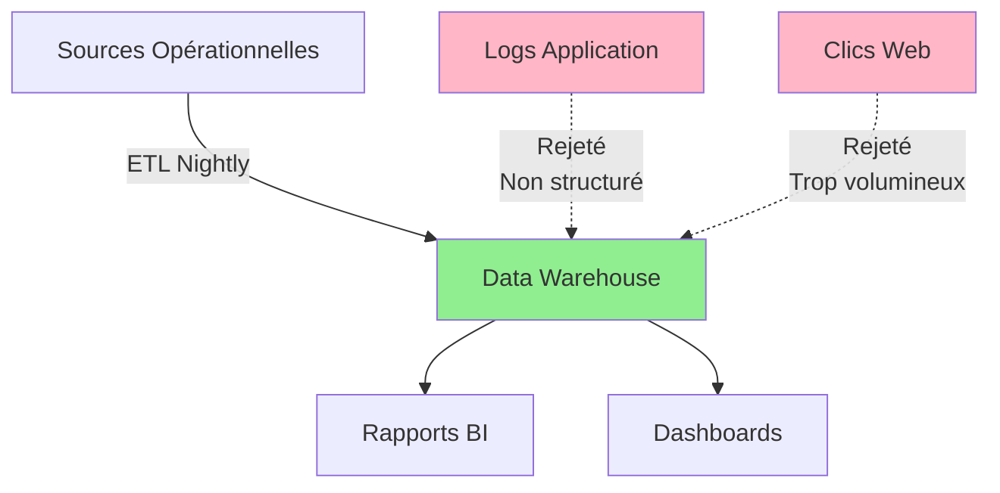
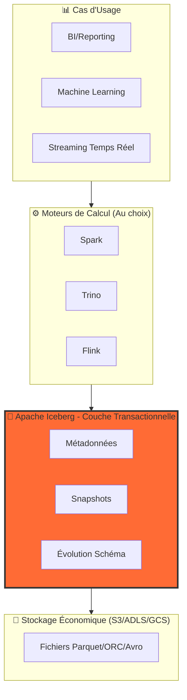
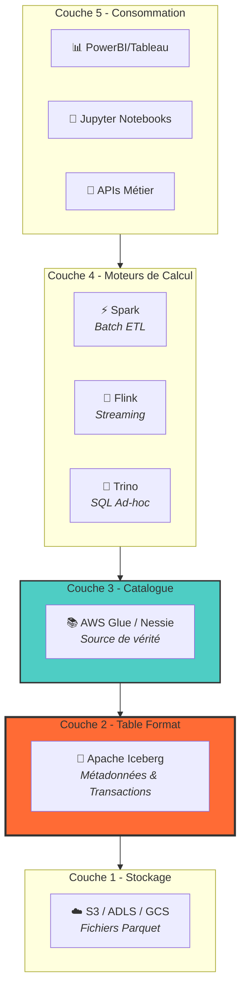

# Chapitre 1 : Le Monde du Lakehouse Apache Iceberg

> _"La meilleure architecture est celle qui peut évoluer sans tout reconstruire."_

En tant qu'architecte de données, vous avez probablement connu l'époque des migrations massives, des nuits blanches pour réécrire des pipelines entiers, et des débats sans fin entre "tout dans l'entrepôt" et "tout dans le lac". Apache Iceberg met fin à ces faux dilemmes. Ce chapitre explique pourquoi.

## 1.1 Qu'est-ce qu'un Data Lakehouse ?

### L'Histoire de Trois Architectures

Pour comprendre le Lakehouse, retraçons l'histoire à travers un cas concret : imaginons une entreprise de streaming vidéo (appelons-la "StreamCo") qui gère les données de visionnage de millions d'utilisateurs.

#### Chapitre 1 : L'Ère du Data Warehouse (1995-2010)

**La promesse** : Une source unique de vérité, structurée et fiable.

StreamCo stocke dans Teradata :

- Tables `utilisateurs` (10 millions de lignes)
- Tables `visionnages` (100 millions de lignes/mois)
- Tables `factures` (5 millions de lignes/mois)

**Ce qui fonctionne** :

- Requêtes SQL ultra-rapides pour le reporting financier
- Transactions ACID garantissant la cohérence
- Outils BI connectés facilement (Tableau, PowerBI)

**Ce qui bloque** :

- Coût : 500 000$/an pour 20 To
- Rigidité : Ajouter une colonne = 3 semaines de planification
- Impossible de stocker les logs d'application (données semi-structurées JSON)



#### Chapitre 2 : L'Ère du Data Lake (2010-2018)

**La promesse** : Stockez tout, à bas coût, analysez plus tard.

StreamCo migre vers Hadoop/HDFS puis AWS S3 :

- Logs applicatifs : 500 Go/jour en JSON
- Événements de clic : 1 To/jour en format Avro
- Coût : 30 000$/an pour 1 Po

**Ce qui fonctionne** :

- Data scientists peuvent explorer librement
- Machine Learning sur données brutes (recommandations vidéo)
- Coût de stockage divisé par 10

**Ce qui bloque** :

```python
# Le cauchemar du Data Engineer
spark.read.parquet("s3://lake/visionnages/year=2023/month=*/")
# ❌ Certains fichiers corrompus (jobs qui ont crashé)
# ❌ Doublons (jobs relancés sans idempotence)
# ❌ Impossible de faire UPDATE/DELETE (RGPD !)
```

Le lac devient un **marécage** :

- Pas de transactions → données corrompues
- Pas d'évolution de schéma → cassures de pipeline
- Pas de gouvernance → impossible de se conformer aux réglementations

#### Chapitre 3 : L'Ère du Lakehouse (2020-présent)

**La promesse** : La fiabilité de l'entrepôt sur l'économie du lac.

StreamCo adopte Apache Iceberg :

- Même stockage S3 (économique)
- Transactions ACID sur les fichiers
- Support UPDATE/DELETE pour la conformité

```sql
-- Maintenant possible avec Iceberg :
DELETE FROM visionnages
WHERE user_id = 'gdpr_request_12345';
-- ✅ Opération atomique, aucun fichier corrompu
```

### Le Lakehouse en un Graphique



### Tableau de Décision pour Architectes

| Votre Besoin                      | Data Warehouse | Data Lake | Data Lakehouse |
| :-------------------------------- | :------------- | :-------- | :------------- |
| **Budget limité (>100 To)**       | ❌             | ✅        | ✅             |
| **Conformité RGPD/CCPA**          | ✅             | ❌        | ✅             |
| **Équipes multiples (BI + ML)**   | ⚠️ Silos       | ⚠️ Chaos  | ✅             |
| **Évolution de schéma fréquente** | ❌             | ⚠️        | ✅             |
| **Pas de vendor lock-in**         | ❌             | ✅        | ✅             |

---

## 1.2 Qu'est-ce qu'Apache Iceberg ?

### Définition Simple

**Apache Iceberg** est une couche logicielle qui transforme vos fichiers Parquet/ORC/Avro sur S3/ADLS en une vraie table de base de données avec transactions, schéma, et historique.

**Ce n'est PAS** :

- ❌ Un moteur de calcul (comme Spark)
- ❌ Un système de stockage (comme S3)
- ❌ Un catalogue (comme Glue)

**C'est** :

- ✅ Un format de **métadonnées** qui décrit comment organiser et lire vos fichiers
- ✅ Un **contrat** entre moteurs de calcul et données

### L'Histoire : Né de la Douleur chez Netflix

En 2017, Netflix gère 200+ Po de données sur S3 avec Apache Hive. Les problèmes sont critiques :

**Problème 1 : Performance**

```python
# Avec Hive
SELECT * FROM events WHERE date = '2023-01-15'
# → Liste TOUS les fichiers dans s3://events/
#   (15 minutes pour 100M fichiers)
```

**Problème 2 : Pas d'atomicité**

```python
# Job Spark qui échoue à 90%
spark.write.mode("append").parquet("s3://events/")
# → 90% des fichiers écrits, 10% manquants
# → Table corrompue !
```

**Problème 3 : Partitionnement fragile**

```python
# Si vous oubliez de filtrer sur la partition...
SELECT * FROM events WHERE user_id = 123
# → Full table scan (catastrophe !)
```

Ryan Blue et son équipe créent Iceberg pour résoudre ces trois problèmes. Netflix open-source le projet en 2018. Il rejoint Apache en 2020.

Aujourd'hui, **Apple**, **Netflix**, **LinkedIn**, **Adobe**, et des centaines d'autres sociétés utilisent Iceberg en production.

### Comment ça Marche : L'Innovation des Métadonnées

La différence fondamentale entre Hive et Iceberg :

**Approche Hive** :

```
s3://warehouse/events/
  ├── year=2023/
  │   ├── month=01/
  │   │   ├── file1.parquet
  │   │   └── file2.parquet
  │   └── month=02/
  └── year=2024/
```

→ Pour lire, Hive liste **tous** les répertoires (lent sur S3).

**Approche Iceberg** :

```
s3://warehouse/events/
  ├── metadata/
  │   ├── v1.metadata.json (décrit la table)
  │   └── snap-123.avro (liste des fichiers)
  └── data/
      ├── file-a.parquet
      ├── file-b.parquet
      └── file-c.parquet
```

→ Iceberg lit `metadata.json`, sait **exactement** quels fichiers lire (rapide).

---

## 1.3 Les Avantages Concrets d'Apache Iceberg

### 1. Transactions ACID : Fini les Données Corrompues

**Situation réelle** : Un job Spark écrit 1000 fichiers et plante au fichier 750.

**Avec Hive** :

- 750 fichiers écrits et visibles
- 250 fichiers manquants
- Table inconsistante
- **Solution** : Effacer et tout relancer

**Avec Iceberg** :

- 750 fichiers écrits physiquement
- Mais le snapshot n'est PAS validé
- Les lecteurs ne voient **rien** (table stable)
- Relancez le job : il reprend de zéro

```sql
-- Les deux opérations sont atomiques
BEGIN;
  DELETE FROM events WHERE date < '2020-01-01';
  INSERT INTO events SELECT * FROM staging_events;
COMMIT;
-- ✅ Tout réussit ou tout échoue, jamais d'état intermédiaire visible
```

### 2. Évolution de Schéma Sans Réécriture

**Scénario** : Votre application ajoute un champ `user_country`.

**Avec Hive** :

```sql
-- ❌ Nécessite de recréer la table
CREATE TABLE events_v2 AS
SELECT *, NULL as user_country FROM events;
-- Coût : Réécrire 100 To
```

**Avec Iceberg** :

```sql
-- ✅ Instantané (mise à jour de métadonnées)
ALTER TABLE events ADD COLUMN user_country STRING;
-- Coût : <1 seconde, 0 réécriture
```

**Bonus** : Les anciennes données retournent `NULL` pour la nouvelle colonne automatiquement.

### 3. Partitionnement Masqué : Zéro Erreur Humaine

**Le piège classique avec Hive** :

```sql
-- Analyste oublie la clause de partition
SELECT COUNT(*)
FROM events
WHERE user_id = 123
-- ❌ Full scan de 500 To (facture de 5000$)
```

**Avec Iceberg** :

```sql
-- La table est partitionnée par DAY(event_time)
-- L'analyste écrit juste :
SELECT COUNT(*)
FROM events
WHERE event_time BETWEEN '2024-01-01' AND '2024-01-31'
-- ✅ Iceberg applique automatiquement le partition pruning
-- Lit uniquement 31 partitions
```

Le partitionnement est une **propriété de la table**, pas une contrainte pour l'utilisateur.

### 4. Time Travel : Votre Machine à Remonter le Temps

**Cas d'usage réels** :

**① Reproduire un modèle ML** :

```sql
-- "Notre modèle de recommandation de décembre donnait de meilleurs résultats"
SELECT * FROM user_features
FOR SYSTEM_TIME AS OF '2024-12-01 00:00:00'
```

**② Rollback après une erreur** :

```sql
-- "On a accidentellement supprimé 1M de lignes"
CALL system.rollback_to_snapshot('db.events', 8723648723648);
-- ✅ Retour en arrière en 2 secondes
```

**③ Conformité et audit** :

```sql
-- "Montrez-moi la table telle qu'elle était le jour de l'audit"
SELECT * FROM transactions
FOR SYSTEM_VERSION AS OF 982347982374;
```

---

## 1.4 L'Écosystème d'un Lakehouse Iceberg

### Les 5 Couches d'une Architecture Iceberg



### Description Pratique des Couches

| Couche           | Composant   | Ce qu'il fait                   | Exemple                       |
| :--------------- | :---------- | :------------------------------ | :---------------------------- |
| **Stockage**     | S3/ADLS/GCS | Héberge les fichiers Parquet    | `s3://datalake/events/`       |
| **Table Format** | Iceberg     | Gère transactions & métadonnées | Fichiers `.metadata.json`     |
| **Catalogue**    | Glue/Nessie | Pointe vers la version actuelle | `warehouse.prod.events → v47` |
| **Compute**      | Spark/Trino | Lit et écrit les données        | `SELECT * FROM events`        |
| **Consommation** | BI Tools    | Interface utilisateur           | Dashboards Tableau            |

### Exemple de Flux Concret

**Scénario** : Ingérer des événements et les requêter

**1. Écriture (Spark/Flink)** :

```python
spark.table("events") \
     .write \
     .format("iceberg") \
     .mode("append") \
     .save()
# → Crée des fichiers Parquet dans S3
# → Met à jour les métadonnées Iceberg
# → Enregistre un nouveau snapshot dans le catalogue
```

**2. Lecture (Trino)** :

```sql
-- Analyste utilise Trino
SELECT platform, COUNT(*)
FROM prod.events
WHERE date = CURRENT_DATE
GROUP BY platform;
# → Trino lit le catalogue
# → Lit les métadonnées Iceberg
# → Sait exactement quels fichiers Parquet lire
```

**3. La magie** : Spark et Trino travaillent sur les **mêmes données** sans conflit ni copie.

---

## 1.5 Résumé : Pourquoi Iceberg Change la Donne

### Les 3 Valeurs Fondamentales

**1. Interopérabilité**

- Vos données ne sont plus liées à un seul moteur
- Spark pour l'ingestion, Trino pour les requêtes, Flink pour le streaming
- Sur les **mêmes tables**

**2. Fiabilité**

- Transactions ACID élimine les corruptions
- Time travel pour rollback et audit
- Conformité réglementaire (GDPR, CCPA)

**3. Simplicité Opérationnelle**

- Évolution de schéma sans downtime
- Partitionnement automatique
- Moins de maintenance, plus d'innovation

### Pour l'Architecte : Les Questions Clés

✅ **Devriez-vous adopter Iceberg ?**

- Oui, si vous gérez >10 To de données analytiques
- Oui, si vous avez besoin de UPDATE/DELETE
- Oui, si vous voulez éviter le vendor lock-in

⚠️ **Quand attendre ?**

- Vous avez <1 To de données (Parquet simple suffit)
- Votre stack est 100% propriétaire (ex: uniquement Snowflake)

### Prochaine Étape

Le chapitre 2 plongera dans l'architecture interne d'Iceberg :

- Structure des métadonnées
- Format des manifests
- Mécanismes de snapshot

Vous comprendrez **comment** Iceberg réalise ses promesses.
